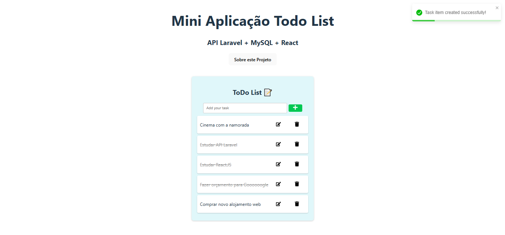

# Todo List with Laravel and React



This is a full-stack web application built with Laravel for the backend API and React with TypeScript for the frontend. It's designed as a simple yet functional `Todo List` application as a experimental project monorepo.

## Folder structure

-   `backend/`: Contains the Laravel backend API code.
-   `frontend/`: Contains the React frontend code.
-   `README.md`: This file, providing an overview of the project.

## Features

-   Create, read, update, and delete (CRUD) operations for todo items.
-   Real-time updates.
-   User-friendly interface.

## How to start the servers

- Backend (Laravel)
    - Go to the backend folder: cd backend
    - Start the server: `php artisan serve`

- Frontend (React)
    - Go to the frontend folder: cd frontend
    - Start the server: `npm run dev`

## How to configure the app in localhost for the first time

- Prerequisites:
    - PHP 8.2 or higher (You can instal XAMPP)
    - MySQL (You can instal XAMPP)
    - Laravel 12.x (this project)
    - Composer
    - Node.js and npm
- Clone the repository:
    ```bash
    git clone https://github.com/dantovsky/todo-list-laravel-react.git
    ```
- Go to the project folder: cd todo-list-laravel-react

- Backend:
    - Go to the backend folder: cd backend
    - Install dependencies: composer install
    - Create a copy of the .env.example file and rename it to .env
    - Generate a new application key: php artisan key:generate
    - Configure the database connection in the .env file
    - Run the migrations: php artisan migrate
    - Run the seeders: php artisan db:seed
    - Start the server: `php artisan serve`

- Frontend:
    - Go to the frontend folder: cd frontend
    - Install dependencies: npm install
    - Start the development server: `npm run dev`

- Access:
    - Frontend: http://localhost:5173